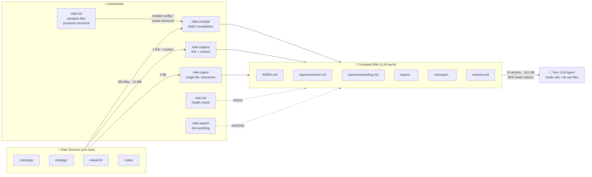

# LLM Wiki Compiler

A Claude Code and Codex-compatible plugin that compiles knowledge into a topic-based wiki — from scattered markdown files **or entire codebases**. Reduce context costs by ~90% and give your agent a synthesized understanding of any project.

**[Documentation](https://saydo-5cd0e3d7.mintlify.app/)**

### What's New in v2.1

- **Codex-compatible plugin metadata** — install from the same `plugin/` package root
- **Skill-first Codex workflows** — use natural prompts instead of Claude slash commands
- **Shared session context helper** — one wiki context renderer for Claude hooks and Codex guidance

### What's New in v2.0

- **Codebase mode** — generate wikis from code repositories, not just markdown files
- **Auto-detection** — `/wiki-init` detects whether you're in a codebase or knowledge project
- **Knowledge graph visualization** — interactive canvas-based graph of your wiki


## Inspiration

This plugin implements the **LLM Knowledge Base** pattern described by [Andrej Karpathy](https://x.com/karpathy/status/2039805659525644595):

> *"Raw data from a given number of sources is collected, then compiled by an LLM into a .md wiki, then operated on by various CLIs by the LLM to do Q&A and to incrementally enhance the wiki, and all of it viewable in Obsidian. You rarely ever write or edit the wiki manually, it's the domain of the LLM."*

The key insight: instead of re-reading hundreds of raw files every session, have the LLM compile them into topic-based articles once, then query the synthesized wiki. Knowledge compounds instead of fragmenting.

## What It Does

You have 100+ files across meetings, strategy docs, codebases, and research. Every Claude session re-reads them. This plugin compiles them into topic-based articles that synthesize everything known about each subject — with backlinks to sources.

**Before:** Read 13+ raw files (~3,200 lines) per session
**After:** Read INDEX + 2 topic articles (~330 lines) per session


### How It Works



## Install

### Clone the repo

```bash
git clone https://github.com/ussumant/llm-wiki-compiler.git
```

### Claude Code

```bash
# Add as a local marketplace
claude plugin marketplace add /path/to/llm-wiki-compiler

# Install the plugin
claude plugin install llm-wiki-compiler

# Restart Claude Code for hooks to register
```

For a single Claude session without installing:

```bash
claude --plugin-dir /path/to/llm-wiki-compiler/plugin
```

### Codex

This repo includes a Codex plugin manifest at `plugin/.codex-plugin/plugin.json` and local marketplace metadata at `.agents/plugins/marketplace.json`. Add this repository as a local Codex plugin marketplace, then install **LLM Wiki Compiler** from that marketplace.

Codex does not use Claude slash commands. Invoke the same workflows with prompts:

| Workflow | Claude Code | Codex prompt |
| --- | --- | --- |
| Initialize | `/wiki-init` | "Initialize a wiki for this repo" |
| Global setup | `/wiki-global-init` | "Set up my global wiki" |
| Capture link | `/wiki-capture URL --context "why it matters"` | "URL — capture this in my wiki" |
| Compile | `/wiki-compile` | "Compile changed sources into the wiki" |
| Ingest | `/wiki-ingest path/to/file.md` | "Ingest this source into the wiki: path/to/file.md" |
| Search | `/wiki-search architecture decisions` | "Search the compiled wiki for architecture decisions" |
| Query | `/wiki-query what do we know about retention?` | "Answer from the compiled wiki: what do we know about retention?" |
| Lint | `/wiki-lint` | "Lint the compiled wiki" |
| Visualize | `/wiki-visualize` | "Launch the wiki knowledge graph" |
| Migrate | `/wiki-migrate` | "Show a wiki-first startup migration report" |

The shared session context helper is available at `plugin/hooks/wiki-session-context`. Claude calls it automatically through the `SessionStart` hook; Codex users can ask Codex to read the compiled wiki at session start until Codex hook registration is standardized.

## Quick Start

### Claude Code

```bash
# 1. Initialize — auto-detects whether this is a codebase or knowledge project,
#    samples your files, proposes a domain-specific article structure
/wiki-init

# 2. Compile — reads all sources, creates topic articles (5-10 min first run)
/wiki-compile

# 3. Visualize — launch an interactive knowledge graph of your wiki
/wiki-visualize

# 4. Browse in Obsidian — open wiki/INDEX.md to see all topics with backlinks
```

After setup, Claude reads wiki articles automatically at session start — no special commands needed. The wiki updates incrementally when sources change.

### Codex

Ask Codex:

```text
Initialize a wiki for this repo
https://example.com/article — capture this in my wiki
Compile changed sources into the wiki
Launch the wiki knowledge graph
```

For ongoing sessions, ask Codex to start with `wiki/INDEX.md`, then read relevant topic articles before raw sources.

## Global and Local Wikis

LLM Wiki Compiler supports two layers:

| Layer | Default location | Use it for |
| --- | --- | --- |
| Global wiki | `~/Knowledge` | Cross-project links, ideas, research, videos, bookmarks, and reusable patterns |
| Local wiki | Current repo/folder with `.wiki-compiler.json` | Deep project-specific architecture, decisions, source files, and operating knowledge |

The default global folder is:

```text
~/Knowledge
```

You can override it:

```bash
export LLM_WIKI_GLOBAL_DIR="$HOME/CompanyKnowledge"
```

Routing defaults:

- "capture this in my wiki" → global wiki
- "capture this in this repo/project wiki" → local wiki
- "capture this in both" → global and local
- no global wiki yet → initialize `~/Knowledge` automatically from the global wiki template

Set it up explicitly with:

```text
Set up my global wiki
```

## Codebase Mode (New in v2.0)

Generate a wiki from a code repository — not just markdown files, but the full knowledge embedded in your codebase: architecture, API contracts, decision records, deployment configs, and gotchas.

### Quick Start

```bash
# One command to set up and compile
/wiki-init --codebase
```

The compiler auto-detects your project type, discovers modules/services, finds knowledge files (READMEs, ADRs, API specs, Docker configs), and compiles everything into topic articles.

### What It Scans

| File Type | Examples | What It Captures |
|-----------|----------|-----------------|
| Documentation | `README.md`, `CLAUDE.md`, `ARCHITECTURE.md` | Purpose, architecture, conventions |
| API contracts | `*.proto`, `*.graphql`, `openapi.yaml` | API surface, inter-service communication |
| Decision records | `ADR-*.md`, `docs/adr/*.md` | Key decisions and rationale |
| Infrastructure | `docker-compose.yml`, `Dockerfile`, `k8s/*.yaml` | Deployment topology, scaling |
| Operations | `docs/runbooks/*.md`, `CHANGELOG.md` | Gotchas, failure modes, version history |
| Config shape | `.env.example`, `package.json` | Environment requirements, dependencies |

With `deep_scan: true`, it also reads entry points, type definitions, and route files for richer articles.

### Example Output

```markdown
# auth-service

## Purpose [coverage: high -- 8 sources]
Handles user authentication and session management via JWT tokens.
All other services call auth-service to validate requests.

## Talks To [coverage: high -- 6 sources]
- **user-service** (REST: /api/users/:id) -- subscription status lookup
- **notification-service** (SQS: auth.password-reset) -- triggers email
- **billing-service** (gRPC) -- validates payment status before premium access

## Key Decisions [coverage: medium -- 3 sources]
- **JWT over sessions** -- stateless scaling, no shared session store (ADR-003)
- **Refresh token rotation** -- security requirement from compliance audit

## Gotchas [coverage: high -- 5 sources]
- Token expiry is 15 minutes, not 1 hour (changed in v2.3)
- Rate limiting on /auth/login is per-IP, not per-user
```

### How It Differs from Google Code Wiki / DeepWiki

Those tools answer "what does this code do?" by parsing functions and generating API docs.

This tool answers **"what does this project *know*?"** by synthesizing documentation, decision records, deployment configs, and operational knowledge into articles an agent can navigate.

| | Google Code Wiki / DeepWiki | LLM Wiki Compiler |
|---|---|---|
| Input | Source code (AST parsing) | Knowledge files + optional code |
| Output | API docs + architecture diagrams | Synthesized topic articles with coverage indicators |
| Infrastructure | Hosted platform / server + embeddings | Zero infra — Claude Code plugin |
| Updates | Full regen on every commit | Incremental — only changed topics |
| Consumer | Developers reading docs | Your AI agent (and you) |

### Monorepo / Microservice Support

For monorepos, the compiler detects service boundaries by looking for directories with their own manifest files (`package.json`, `go.mod`, etc.). Each service becomes a topic article. Cross-cutting concerns (infrastructure, testing, deployment) get their own articles.

```
📚 Wiki compiled — 8 topics from 47 files

  Topics created:
  ├── auth-service (12 sources)
  ├── billing-service (9 sources)
  ├── notification-service (6 sources)
  ├── api-gateway (5 sources)
  ├── infrastructure (4 sources)
  ├── testing (3 sources)
  └── deployment (3 sources)

  Concepts discovered:
  ├── error-handling-strategy — shared pattern across 4 services
  └── auth-flow — touches auth, gateway, billing
```

### Codebase Configuration

```json
{
  "version": 2,
  "mode": "codebase",
  "name": "My Project",
  "sources": [{ "path": "./", "exclude": ["node_modules/", "dist/", ".git/", "wiki/"] }],
  "output": "wiki/",
  "service_discovery": "auto",
  "deep_scan": false,
  "knowledge_files": ["README.md", "CLAUDE.md", "*.proto", "openapi.*", "ADR-*.md", "Dockerfile"]
}
```

| Field | Description |
|-------|-------------|
| `mode` | `"codebase"` enables code-aware topic discovery |
| `service_discovery` | `"auto"` detects monorepo vs single project |
| `deep_scan` | `true` to also read source code files for richer articles |
| `knowledge_files` | Glob patterns for priority documentation files |

## Knowledge Graph Visualization

See your compiled wiki as an interactive knowledge graph. Topics appear as nodes sized by source count, concepts as connecting edges.

```bash
/wiki-visualize
```

- **Hover** nodes to see source count and highlight connections
- **Click** a node to read the full article in a side panel with coverage badges
- **Shift-click** a node to expand its neighborhood — concept-connected topics light up, others dim. Shift-click again to keep walking the graph (depth 2, depth 3, …). The HUD shows how many nodes and seeds are currently lit.
- **Hover edges** to see concept names linking topics
- **Search** to filter topics by name or alias
- **Escape** to close the article panel or clear the expansion

Canvas-based, zero dependencies, Nothing Design System tokens (Space Grotesk + Space Mono typography). Works with both knowledge mode and codebase mode wikis.

You can also run it manually without the plugin:
```bash
node plugin/visualize/server.js --wiki-dir path/to/wiki/
# Open http://localhost:3848
```

## Fetch from External Sources

Your context isn't always on disk — a lot of it lives in services like X bookmarks, Readwise highlights, or Pocket saves. `/fetch-bookmarks <source>` pulls that content into a local directory that `/wiki-compile` can consume alongside your regular sources.

Optional — skip it entirely if all your sources are already local markdown.

### Quick Start

```bash
/fetch-bookmarks x
```

First run walks you through:

1. Checking that Node.js 20+ is installed
2. Installing [Field Theory CLI](https://github.com/afar1/fieldtheory-cli) (MIT-licensed, free) globally via npm — one consent prompt
3. Syncing your X bookmarks using Chrome cookie auth (no X API key needed)
4. Adding `~/.fieldtheory/library/` to your `.wiki-compiler.json` sources

After that, `/fetch-bookmarks x` just resyncs. Run `/wiki-compile` whenever you want bookmarks folded into topic articles.

### Auto-Sync (Set and Forget)

Manual syncing gets forgotten. Install a daily background job:

```bash
/fetch-bookmarks schedule x
```

On macOS this writes a `launchd` plist to `~/Library/LaunchAgents/dev.llm-wiki-compiler.x-sync.plist` that runs `ft sync && ft md` daily at 03:00 local. No LLM tokens, no Claude Code needed — pure shell. On Linux/WSL you get a `crontab` snippet to paste.

The `/wiki-compile` step stays manual by design — it needs an LLM and your judgment. When you next open Claude Code in a wiki project, the session-start hook tells you how many new bookmarks have arrived since the last compile, so your intent translates to action without you having to track dates.

Uninstall with `/fetch-bookmarks schedule x --uninstall` (or `launchctl unload` manually).

### Available Sources

| Source | Status | Backend |
|--------|--------|---------|
| `x` | Shipped | [Field Theory CLI](https://github.com/afar1/fieldtheory-cli) (MIT) |
| `readwise` | Planned | TBD |
| `pocket` | Planned | TBD |
| `github-stars` | Planned | TBD |

### How It Works

`/fetch-bookmarks` is a thin dispatcher. Each source has its own adapter at `plugin/skills/wiki-compiler/adapters/<source>.md` that handles dependency checks, auth, sync, and wiring the output directory into your wiki config. Adapters delegate to existing open-source tools rather than reimplementing fetch logic — so you get a stable plugin surface (`/fetch-bookmarks x`) while the heavy lifting is maintained upstream.

### Requirements

- **Node.js 20+** (for Field Theory CLI)
- **Chrome** (for first-time X cookie sync — this is a Field Theory CLI limitation)

### Contributing a New Adapter

Copy `plugin/skills/wiki-compiler/adapters/x.md` and follow the contract documented in `plugin/commands/fetch-bookmarks.md`: preflight, consent, sync, markdown output, wire into `sources[]`, suggest compile.

## Capture Links With Context

The primary UX is: paste a link and say **"capture this in my wiki."** You do not need to remember command names.

In Codex:

```text
https://example.com/article

capture this in my wiki
```

Add context when you have it:

```text
https://example.com/article

capture this in my wiki

Context: Relevant to Codex plugin onboarding and skill discovery.
```

Claude Code users can use the explicit command form:

```bash
/wiki-capture https://example.com/article --context "Relevant to Codex plugin onboarding and skill discovery"
```

The capture flow is adapter-based:

| Source | Adapter | What gets saved |
|--------|---------|-----------------|
| Web article | `capture-web` | readable page text, metadata, relevance notes |
| YouTube | `capture-youtube` | transcript evidence, timestamps, workflow notes when relevant |
| X/Twitter link | `capture-x` | post/thread text or bookmark source, date-aware relevance notes |

Captured links are written to `wiki-sources/captures/` inside the target wiki as markdown with frontmatter, the original URL, captured date, user context, extracted content, relevance notes, and candidate wiki connections. The wiki then uses the same ingest/compile logic to update existing topics or propose a new topic/concept.

### Connector Roadmap

The capture system is intentionally adapter-based. Future connectors should feed durable, provenance-rich source markdown into the same compiler pipeline instead of writing topic articles directly.

Planned connector shape:

```text
connector pulls context
→ normalizes to markdown with metadata
→ writes to wiki-sources/{connector}/
→ adds that folder to sources[]
→ wiki compile builds topic/concept connections
```

Candidate connectors:

| Connector | Use case |
|-----------|----------|
| Granola | Meeting notes, summaries, decisions, and follow-ups |
| Google Drive / Docs | Docs, strategy notes, specs, and research folders |
| Slack | High-signal threads, decisions, and customer/team context |
| Linear / GitHub Issues | Roadmap, bugs, project decisions, and implementation context |
| Readwise / Pocket | Reading highlights and saved articles |

The key rule: connectors create source material; the wiki compiler owns synthesis and connections.

## How It Works (Knowledge Mode)

### Commands

| Command | Purpose |
|---------|---------|
| `/wiki-init` | One-time setup -- auto-detects markdown directories, samples files, proposes custom article structure |
| `/wiki-global-init` | Initialize the default global wiki at `~/Knowledge` or `LLM_WIKI_GLOBAL_DIR` |
| `/wiki-compile` | Compiles source files into topic articles (incremental -- only recompiles changes). Generates `schema.md` on first run. |
| `/wiki-capture` | Capture a URL plus context, normalize it into markdown, and connect it to existing topics/concepts |
| `/wiki-ingest` | Add a single source interactively -- read, discuss key takeaways, update relevant wiki articles |
| `/fetch-bookmarks` | Pull bookmarks from external services (X today; Readwise, Pocket planned). `schedule <source>` wires a daily launchd job. |
| `/wiki-search` | Search across wiki articles by keyword or phrase |
| `/wiki-lint` | Health checks -- finds stale articles, orphan pages, missing cross-references, contradictions, low coverage |
| `/wiki-query` | Optional -- Q&A against the wiki. Can file useful answers back into wiki articles. |
| `/wiki-migrate` | One-time migration -- analyzes your AGENTS.md startup reads, shows which are covered by wiki, generates replacement |
| `/wiki-visualize` | Launch interactive knowledge graph of your compiled wiki |
| `/wiki-upgrade` | Update the plugin to the latest version from GitHub |

The primary workflow is: **init → compile → add to AGENTS.md → done.** After that, Claude reads the wiki automatically. `/wiki-query` is a convenience for testing or quick lookups.

### Staged Adoption (The Key Feature)

The plugin never modifies your existing CLAUDE.md or AGENTS.md. Instead, it injects context via a SessionStart hook with three modes:

| Mode | What Happens | Your Existing Setup |
|------|-------------|-------------------|
| **staging** (default) | "Wiki available — check it when you need depth" | Completely unchanged |
| **recommended** | "Check wiki articles before raw files" | Unchanged, but Claude prioritizes wiki |
| **primary** | "Wiki is your primary knowledge source" | You can optionally simplify startup reads |

Change mode by editing `.wiki-compiler.json`:
```json
{ "mode": "staging" }  →  { "mode": "recommended" }  →  { "mode": "primary" }
```

### What Gets Compiled

During `/wiki-init`, the compiler samples your source files and proposes an article structure that fits your domain. You approve (or tweak) the sections before anything gets compiled.

For example, a product team's wiki might get:
- **Summary** — **Timeline** — **Current State** — **Key Decisions** — **Experiments & Results** — **Gotchas** — **Open Questions** — **Sources**

While a research wiki might get:
- **Summary** — **Key Findings** — **Methodology** — **Evidence** — **Gaps & Contradictions** — **Open Questions** — **Sources**

And a book notes wiki might get:
- **Summary** — **Characters** — **Themes** — **Plot Threads** — **Connections** — **Quotes** — **Sources**

The structure is saved in `.wiki-compiler.json` and can be edited anytime. **Summary** and **Sources** are always included.

### Coverage Indicators (Best of Both Worlds)

Every section includes a coverage tag so you (or your AI agent) know when to trust the wiki vs when to read raw sources:

```markdown
## Summary [coverage: high -- 15 sources]
...trust this, it's well-sourced...

## Experiments & Results [coverage: medium -- 3 sources]
...decent overview, check raw files for details...

## Gotchas [coverage: low -- 1 source]
...read the raw gotchas.md directly...
```

- **high** (5+ sources) — trust the wiki section directly
- **medium** (2-4 sources) — good overview, check raw sources for granular questions
- **low** (0-1 sources) — read the raw sources listed in that section

This gives you the speed of the wiki (84% fewer tokens) without sacrificing accuracy. Your agent reads the wiki first, and only falls back to raw files for low-coverage sections.

### Time-Decay Awareness

Tweets from 2022 and tweets from 2026 don't carry equal weight on questions about AI tooling or UI patterns — so the compiler doesn't treat them as equal either. For **time-sensitive topics** (AI, design, growth tactics, bookmark-heavy topics), the compiler:

- Extracts a source date from each input (frontmatter `posted_at` / `date`, filename date, or mtime)
- Orders Timeline and Key Decisions bullets newest-first, date-prefixed
- Flags claims older than 18 months with ⚠️
- Adds `[as of YYYY-MM]` tags to sections resting mostly on aging sources
- In conflicts, prefers the newer source and notes the shift

Stable topics (career, personal growth, visa work) use looser thresholds (24/48 months). Nothing gets deleted — stale entries stay for historical context, just clearly marked.

### Obsidian Compatible

The wiki output is plain markdown with Obsidian-style `[[wikilinks]]`. Open `wiki/INDEX.md` in Obsidian and you'll see the full knowledge base with bidirectional links to source files.

### Concept Articles (Cross-Cutting Patterns)

After compiling topic articles, the compiler looks for patterns that span 3+ topics and generates **concept articles** in `wiki/concepts/`. These are interpretive, not just factual -- they answer "what does this pattern mean?" not just "what happened?"

Examples from a real project:
- **"Speed vs Quality Tradeoff"** -- 6 instances where this decision appeared across retention, push notifications, and experiment design
- **"Cross-Team Decision Patterns"** -- communication patterns and decision dynamics synthesized from 24 meetings
- **"Evolution of Retention Thinking"** -- how the approach changed from Oct 2025 to Apr 2026 across analytics, strategy, and experiments

Concept articles are discovered automatically during compilation. You can also seed them in `schema.md` if you know what patterns you want tracked.

### Schema Document

On first compile, a `schema.md` is generated in your wiki output directory. It defines your wiki's structure: topic list, naming conventions, article format, and cross-reference rules.

You can edit `schema.md` to rename topics, merge them, or add conventions. The compiler reads it before each run and respects your changes. New topics get added automatically with an evolution log entry.

### Wiki Lint

Run `/wiki-lint` to check wiki health:

- **Stale articles** -- sources changed since last compile
- **Orphan pages** -- articles with deleted/missing sources
- **Missing cross-references** -- topics sharing 3+ sources that don't link to each other
- **Low coverage sections** -- `[coverage: low]` tags flagged for improvement
- **Contradictions** -- conflicting facts across articles (e.g., different dates for same event)
- **Schema drift** -- topics in wiki/ not listed in schema.md, or vice versa

### Query Filing

When `/wiki-query` produces a useful synthesis that connects information across topics, it offers to file the answer back into the relevant wiki article. Your explorations compound in the knowledge base instead of disappearing with the session.

## Configuration

`.wiki-compiler.json` (created by `/wiki-init`):

```json
{
  "version": 2,
  "name": "My Project",
  "mode": "staging",
  "sources": [
    { "path": "Knowledge/", "exclude": ["wiki/"] },
    { "path": "docs/meetings/" }
  ],
  "output": "Knowledge/wiki/",
  "topic_hints": ["retention", "onboarding"],
  "link_style": "obsidian"
}
```

| Field | Description |
|-------|-------------|
| `version` | Config version (`2` for latest) |
| `name` | Display name for the knowledge base |
| `mode` | Integration mode: `staging` / `recommended` / `primary` — OR `codebase` for code repositories |
| `sources` | Directories to scan |
| `output` | Where compiled wiki lives |
| `article_sections` | Article structure — generated during `/wiki-init` based on your content (see below) |
| `topic_hints` | Optional seed topics to guide classification |
| `link_style` | `obsidian` (wikilinks) or `markdown` (standard links) |
| `service_discovery` | (codebase mode) `auto` or `manual` — how to detect modules/services |
| `knowledge_files` | (codebase mode) Glob patterns for priority documentation files |
| `deep_scan` | (codebase mode) `true` to also read source code files |

### Custom Article Structure

The `article_sections` array defines what sections appear in each topic article. It's generated during `/wiki-init` by sampling your source files — the compiler proposes sections that fit your domain, and you approve or tweak them.

```json
"article_sections": [
  { "name": "Summary", "description": "standalone briefing of the topic", "required": true },
  { "name": "Key Findings", "description": "main discoveries and insights" },
  { "name": "Methodology", "description": "approaches and methods used" },
  { "name": "Open Questions", "description": "unresolved threads and gaps" },
  { "name": "Sources", "description": "backlinks to all contributing files", "required": true }
]
```

You can edit this array anytime — add, remove, or rename sections. The compiler will use your updated structure on the next `/wiki-compile` run. `Summary` and `Sources` are required and cannot be removed.

If `article_sections` is missing (older configs), the compiler falls back to a default template.

## Safety Guarantees

- Source files are **never modified** — the compiler only writes to the output directory
- The wiki can be **deleted and regenerated** at any time from source files
- Your **CLAUDE.md and AGENTS.md are never touched** — context injection happens via hooks
- **Rollback anytime** — change mode back to `staging` or delete `.wiki-compiler.json`

## Cost Savings (Real Data)

Tested on a real project with 1,183 markdown files across meetings, strategy docs, session histories, and research notes.

### Token Reduction

| | Without Wiki | With Wiki |
|---|---|---|
| Session startup context | ~79K tokens (13 files) | ~8.5K tokens (INDEX + 2-3 articles) |
| Per-question research | ~8,000 tokens (10+ files) | ~600 tokens (1 article) |
| **Reduction** | — | **89%** |

### Compilation Costs

| | Tokens | Cost (Opus) | Cost (Sonnet) |
|---|---|---|---|
| First compilation | ~880K | ~$13 | ~$2.60 |
| Daily incremental | ~100K | ~$1.50 | ~$0.30 |
| **Break-even** | — | **First session** | **First session** |

### Accuracy

We spot-checked wiki articles against their raw source files:

- **10/10 key facts accurately synthesized** -- no fabrication, no missing critical details
- **Coverage indicators are honest** -- sections marked `[coverage: high]` had 5+ contributing sources
- **Trade-off is transparent** -- wiki captures ~90% of raw file content; coverage tags tell you when to fall back to raw sources for the remaining 10%

### Compression

- 1,183 files → 14 topic articles -- **84x compression**
- Session startup: 13 file reads → 1 INDEX + 2-3 topic articles -- **89% fewer tokens**
- ~$1.05 saved per session at Opus pricing ($15/M input tokens)

## Integrating with AGENTS.md (Recommended)

This is the main way to use the wiki long-term. After you've compiled and spot-checked the output, add this to your project's AGENTS.md or CLAUDE.md:

```markdown
## Knowledge Base

A compiled knowledge wiki is available at `{your output path}/`.

**Session startup:** Read `wiki/INDEX.md` for a topic overview, then read
specific topic articles relevant to your current task.

**Using coverage indicators:** Each section has a coverage tag:
- `[coverage: high]` -- trust this section, skip the raw files.
- `[coverage: medium]` -- good overview, check raw sources for granular questions.
- `[coverage: low]` -- read the raw sources listed in that section directly.

**When you need depth:** Check the article's Sources section for links to
raw files. Only read raw sources for medium/low coverage sections or when
you need very specific detail.

**Never modify wiki files directly** -- they are regenerated by `/wiki-compile`.
```

Once this is in your AGENTS.md, Claude automatically uses the wiki every session with smart fallback. High-coverage sections save tokens. Low-coverage sections point Claude to the exact raw files it needs.

**When to add this:** After running `/wiki-compile` at least once and validating that the topic articles accurately reflect your knowledge.

## Advanced

### Incremental Compilation

After the first full compile, `/wiki-compile` only recompiles topics whose source files changed. INDEX.md is always regenerated.

### Force Full Recompile

```
/wiki-compile --full
```

### Compile Single Topic

```
/wiki-compile --topic retention
```

### Interactive Ingest

Add sources one at a time with `/wiki-ingest`:

```
/wiki-ingest path/to/new-meeting-notes.md
```

The compiler reads the file, shows you key takeaways, asks what to emphasize, then updates all relevant topic articles. A single source might touch multiple topics — the compiler handles the cross-referencing.

This is Karpathy's recommended workflow for staying involved with your knowledge base as it grows. Use `/wiki-compile` for batch processing, `/wiki-ingest` for interactive single-source additions.

### Wiki Search

Search your compiled wiki:

```
/wiki-search retention experiments
```

Searches topic names first (fast), then full article content if needed. Results include coverage indicators so you know when to trust the wiki vs read raw sources.

For synthesis questions that require connecting multiple topics, use `/wiki-query` instead.

For large wikis (100+ topics), consider adding [qmd](https://github.com/jina-ai/qmd) as an MCP server for hybrid BM25/vector search with LLM re-ranking.

### Migrate to Wiki-First Startup

Once your wiki is compiled and spot-checked, run `/wiki-migrate` to switch your AGENTS.md from reading raw files to reading the wiki:

```
/wiki-migrate

Wiki Migration Report for "My Project"

Current startup: 13 file reads

✅ gotchas.md → covered by analytics [coverage: high]
✅ product-context.md → covered by product [coverage: high]
⚠️ reporting-backlog.md → partially covered [coverage: medium]
❌ acceptance-criteria.md → not covered (operational checklist)

Summary: 10/13 reads can be replaced
Estimated savings: ~79K → ~8.5K tokens (89% reduction)
```

The command generates a replacement startup section and applies it with your confirmation.

### Stale Wiki Detection

The plugin automatically detects when source files have changed since the last compile. Enable it in `.wiki-compiler.json`:

```json
{ "auto_update": "prompt" }
```

With `prompt` mode, the SessionStart hook counts changed files and warns:

> "Wiki may be stale — 42 files changed since last compile (2026-04-06). Run /wiki-compile to update."

Set to `"off"` (default) to disable.

### Scheduled Compilation

Use Claude Code's `/schedule` to set up daily automatic compilation.

### Updating the Plugin

From inside Claude Code:
```
/wiki-upgrade
```

This pulls the latest version from GitHub and shows what changed. Restart Claude Code after to load new commands and hooks.

If `/wiki-upgrade` isn't available yet (older version), update manually:
```bash
cd /path/to/llm-wiki-compiler && git pull
claude plugin update llm-wiki-compiler
# Then restart Claude Code
```

## License

MIT
